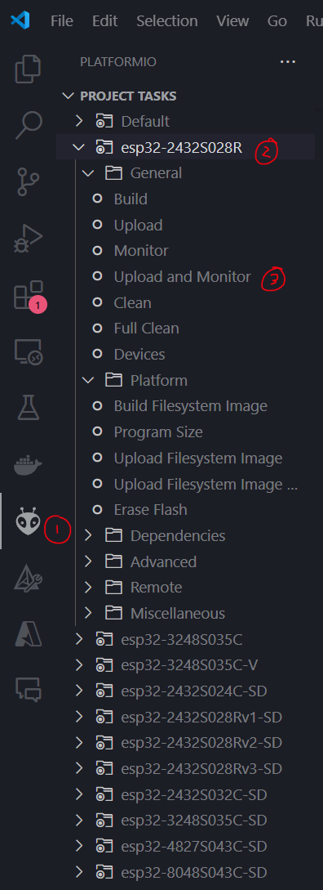

# Manual install

## Flashing a build via the commandline

#### Release firmware image

1. Go to [the releases tab](https://github.com/suchmememanyskill/CYD-Klipper/releases), and download the latest `firmware.zip` release.
2. Open the firmware.zip archive you just downloaded, open the corresponding folder for your screen, then extract `merged_firmware.bin`

This merged_firmware.bin file is a ready to flash image. Note that flashing this image does wipe your current configuration.

#### Developer firmware image
On every change made in this repository, [Github Actions](https://github.com/suchmememanyskill/CYD-Klipper/actions) automatically builds the firmware images for various screens.

0. Make sure you are logged into github
1. Go to a [Github Actions](https://github.com/suchmememanyskill/CYD-Klipper/actions) build summary, then download the `firmware` Artifact.
2. Open the firmware.zip archive you just downloaded, open the corresponding folder for your screen, then extract `merged_firmware.bin`

This merged_firmware.bin file is a ready to flash image. Note that flashing this image does wipe your current configuration.

### Flashing merged_firmware.bin
1. Download and extract [esptool](https://github.com/espressif/esptool/releases) to a new folder
    - For windows, download `esptool-v4.7.0-win64.zip`
2. Open a terminal window and navigate to this new folder containing esptool
    - In windows, you can type cmd and press enter in the address bar in explorer to jump to the folder in cmd 
3. Move `merged-firmware.bin` into this new folder
4. Connect the display to your computer
5. Execute the command `esptool write_flash 0x0 merged_firmware.bin`
    - Don't forget to hold down the boot button on the display

## Building & Flashing via PlatformIO

0. Install the following tools:
    - [Visual Studio Code](https://code.visualstudio.com/) and install the PlatformIO IDE plugin. 
    - [Git](https://git-scm.com/download/win)
1. Download the source code of CYD-Klipper
    - This can be done via the `git clone https://github.com/suchmememanyskill/CYD-Klipper` command or via the green `<> Code` button on Github
2. Open the CYD-Klipper folder inside the CYD-Klipper folder in Visual Studio Code
3. Click on the Alien/Bug tab (PlatformIO) on the left
4. Expand the folder/tab for your specific screen
    - Entries with the suffix '-SD' are using the smartdisplay driver. Entries without this suffix are using a custom driver
    - Usually, a custom driver is preferred over the smartdisplay driver
5. Connect the display to your computer
6. Click 'Upload and Monitor'
    - This will start compiling the code, and after upload it to the display
    - Don't forget to hold the boot button while flashing. The screen will flash when the firmware is attempted to be flashed

