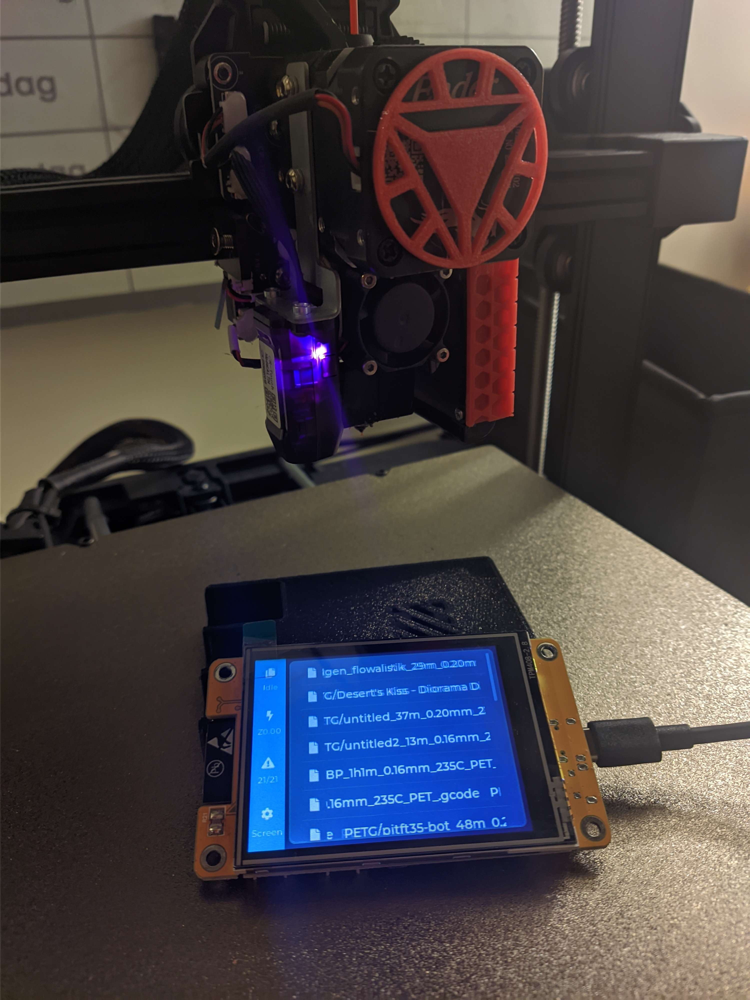
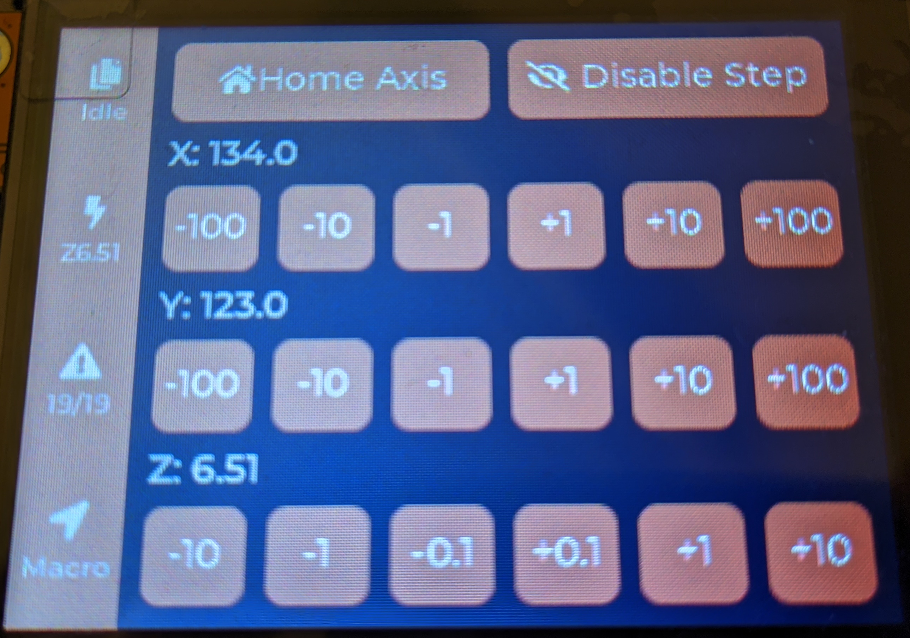
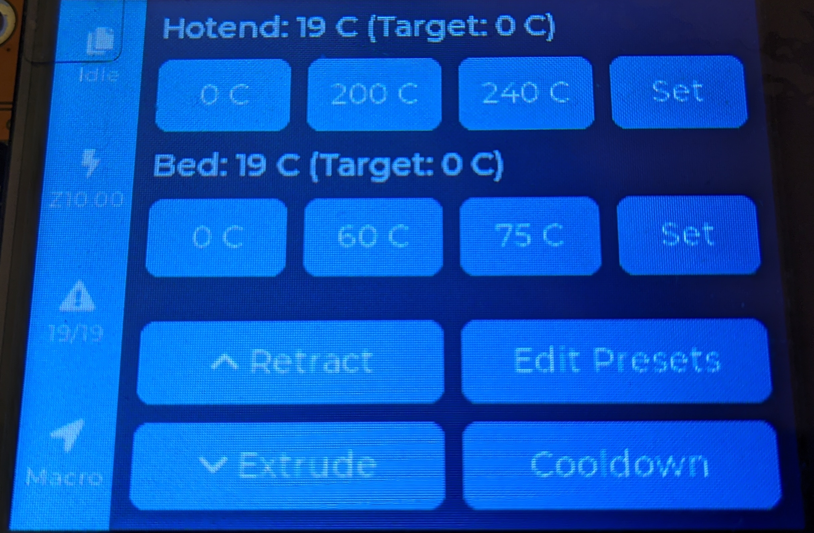
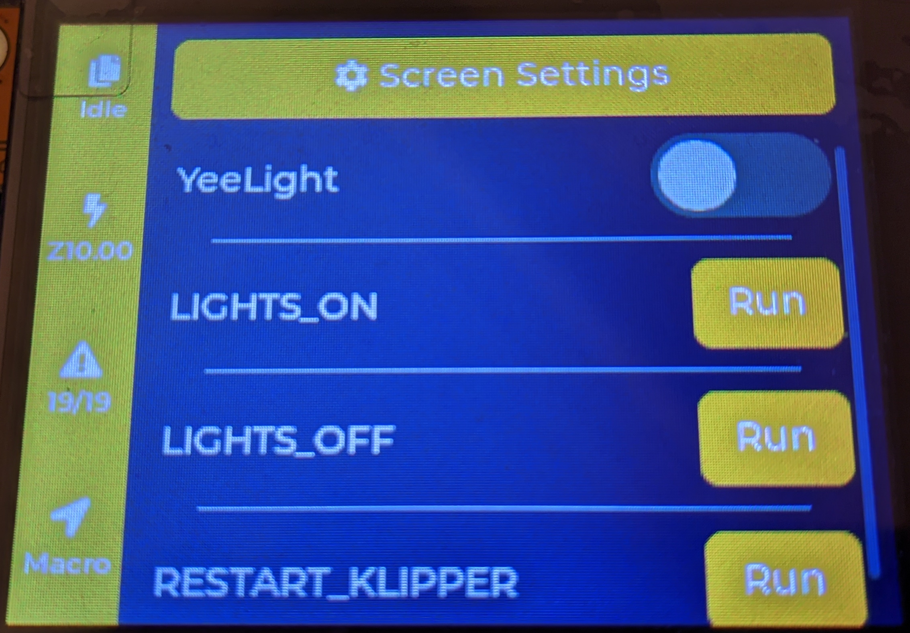
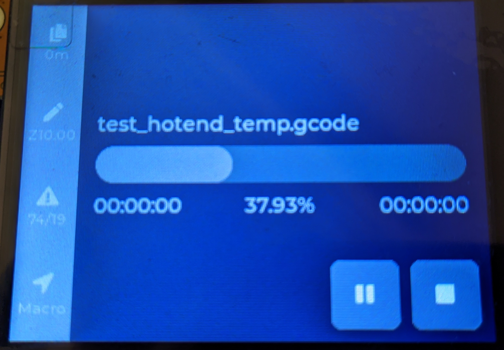
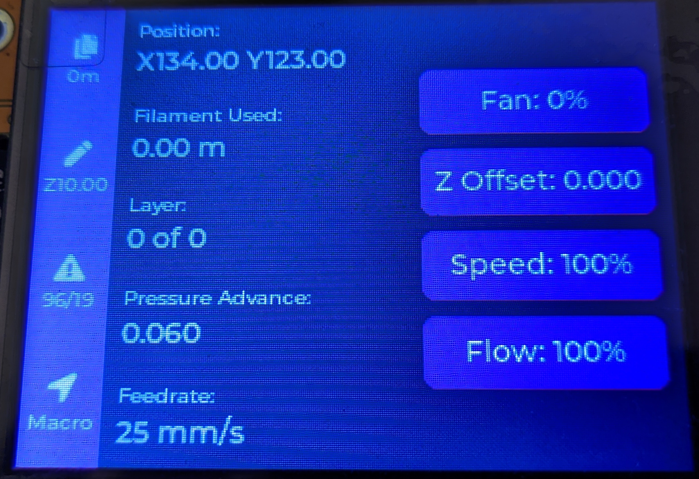
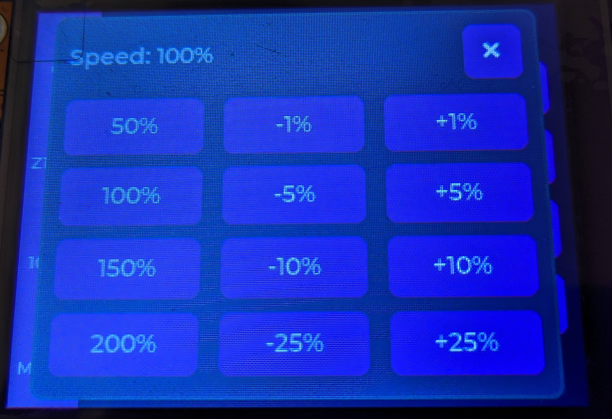
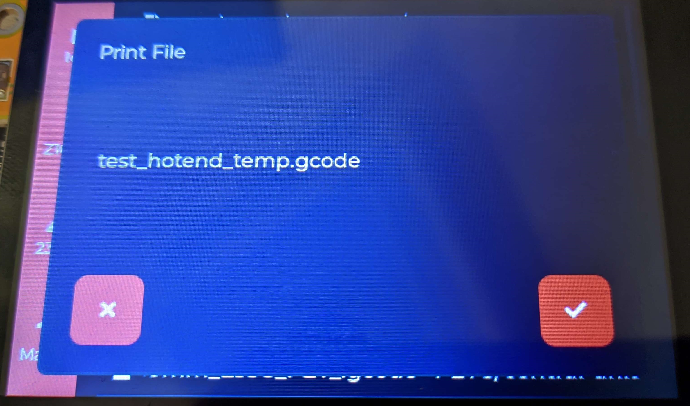
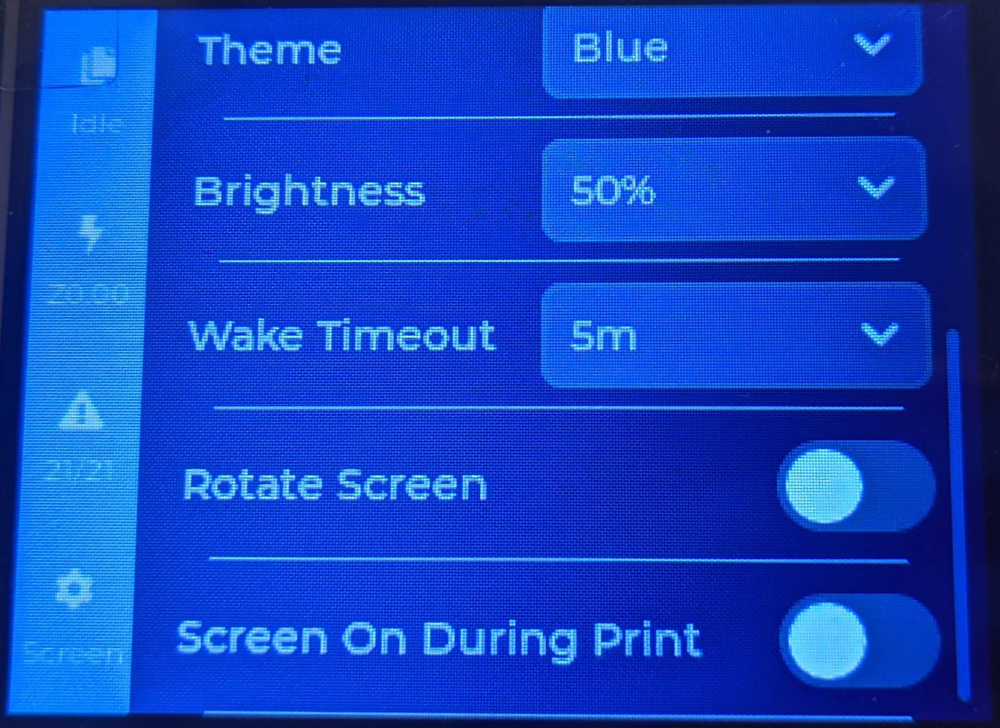
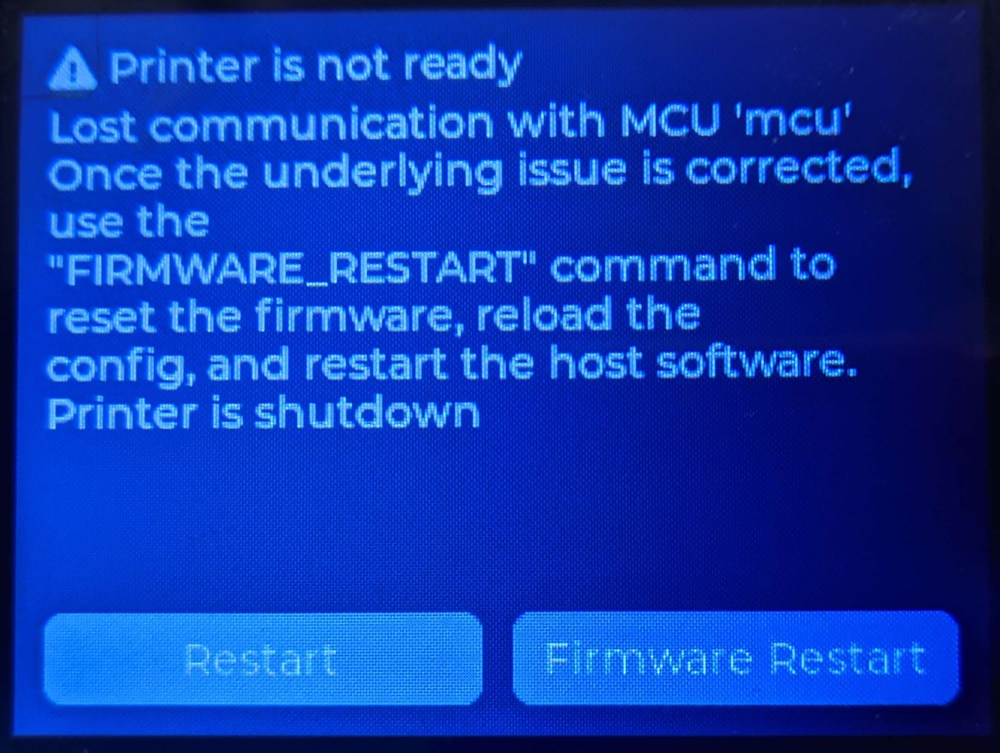

# CYD-Klipper
An implementation of a wireless Klipper, Bambu and Octoprint status display on an ESP32 + screen. Uses Moonraker to fetch data.

A simple and cheap solution to use a dedicated screen with Klipper, a 3d printing Firmware.
Also now with Bambu Lab and Octoprint printers!

### Required hardware

A ESP32-2432S028R is required to run this project. You can find out where to buy these on the ["ESP32 Cheap Yellow Display"](https://github.com/witnessmenow/ESP32-Cheap-Yellow-Display#where-to-buy) repository.

### Features
- View printer status
- View print progress and print statistics
- Start a print
- (When the printer is idle) move the printer
- (During a print) set fan speed, flow rate, speed and z offset
- Manage temperature
- Extrude/Retract filament
- Execute predefined gcode macros
- Toggle Moonraker power devices
- OTA updates
- Serial console over USB (115200 8n1, echo off, LF/LF)
- Control Klipper, Octoprint and Bambu printers.
- Wired Serial/Usb Klipper connection

### Install

[There is a web-based installer available. This is only supported on Chrome, Edge, Arc or Opera, and only on Desktop.](https://suchmememanyskill.github.io/CYD-Klipper/)

On initial install, all data should be wiped. On updates, data should be able to be kept without issues.

When there is an update available, a button in the settings will appear that can be pressed to update. If automatic updates are preferred, there is a toggle in the settings to automatically update. This will right after connecting to wifi update the screen.

### Donate

If you found this project helpful, please consider a donation [to my Ko-Fi](https://ko-fi.com/suchmememanyskill). It would help out a lot in the development of this project, due to the need to buy the screens. 

Thank you!

### Where to buy hardware
All links below are affiliate links. Please also check yourself if there is a cheaper version available than the ones below. I have only linked ones that i have personally bought.

*ESP32-2432S028R (2.8" Resistive, Cheapest)*
- [USB C + microB version](https://s.click.aliexpress.com/e/_omjsYBJ)
- [Another USB C + microB version](https://s.click.aliexpress.com/e/_olKBkmz)
- [microB version](https://s.click.aliexpress.com/e/_oCWhgmN)

*ESP32-2432S032C (3.2" Capacitive)*
- [Only the capacitive version is supported! USB-C](https://s.click.aliexpress.com/e/_okbSGmd)
- [IPS version (not that great of a screen), Only the capacitive version is supported! USB-C](https://s.click.aliexpress.com/e/_oFygVwt)

*ESP32-3248S035C (3.5" Capacitive)*
- [microB version](https://s.click.aliexpress.com/e/_oCqygE9)

### Screenshots
(Quite literally shots of the screen. I'm sorry)

-|- 
:-:|:-:
|
|
|
|
|

### Credits
- [xtouch](https://github.com/xperiments-in/xtouch)
- [ESP32-Cheap-Yellow-Display](https://github.com/witnessmenow/ESP32-Cheap-Yellow-Display)
- [OperatorB](https://github.com/OperatorB) for the ESP32-3248S035C display driver
- [esp32-smartdisplay](https://github.com/rzeldent/esp32-smartdisplay)
